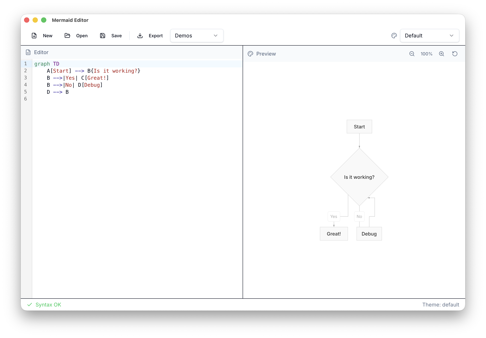

# Beautiful Mermaid Editor

A modern desktop application for creating and editing Mermaid diagrams with live preview, syntax highlighting, and autocompletion.



## Features

- **Live Preview** - See your diagram render in real-time as you type
- **Syntax Highlighting** - VSCode-style editor with Mermaid syntax support
- **Autocompletion** - Smart suggestions for Mermaid syntax
- **Theme Switching** - Multiple themes (default, dark, tokyo-night, dracula, github-dark, nord, one-dark, solarized-light, solarized-dark, monokai)
- **Export** - Export diagrams as SVG
- **Pan & Zoom** - Drag to pan and pinch-to-zoom (25%-500%)
- **Desktop Integration** - Native file dialogs and system integration
- **Clipboard Import** - Automatically detect Mermaid content in clipboard on startup

## Getting Started

### Prerequisites

- Node.js 20+
- Rust (latest stable)
- npm or pnpm

### Installation

```bash
# Install dependencies
npm install

# Start development server
npm run dev

# Run with Tauri (desktop mode)
npm run tauri dev
```

### Building

```bash
# Build for production
npm run tauri build
```

The built app will be in `src-tauri/target/release/bundle/macos/`.

### CLI Tool

```bash
# Install CLI tool (optional)
sudo ln -sf "$(pwd)/src-tauri/target/release/mermaid-editor" /usr/local/bin/bmermaid

# Open file with specific theme
bmermaid diagram.mmd -t dark

# Show help
bmermaid --help
```

## Tech Stack

- **Tauri v2** - Desktop framework
- **React 19** - UI framework
- **CodeMirror 6** - Code editor
- **beautiful-mermaid** - Mermaid rendering
- **codemirror-lang-mermaid** - Syntax highlighting
- **shadcn/ui** - UI components
- **Tailwind CSS v4** - Styling

## License

MIT
